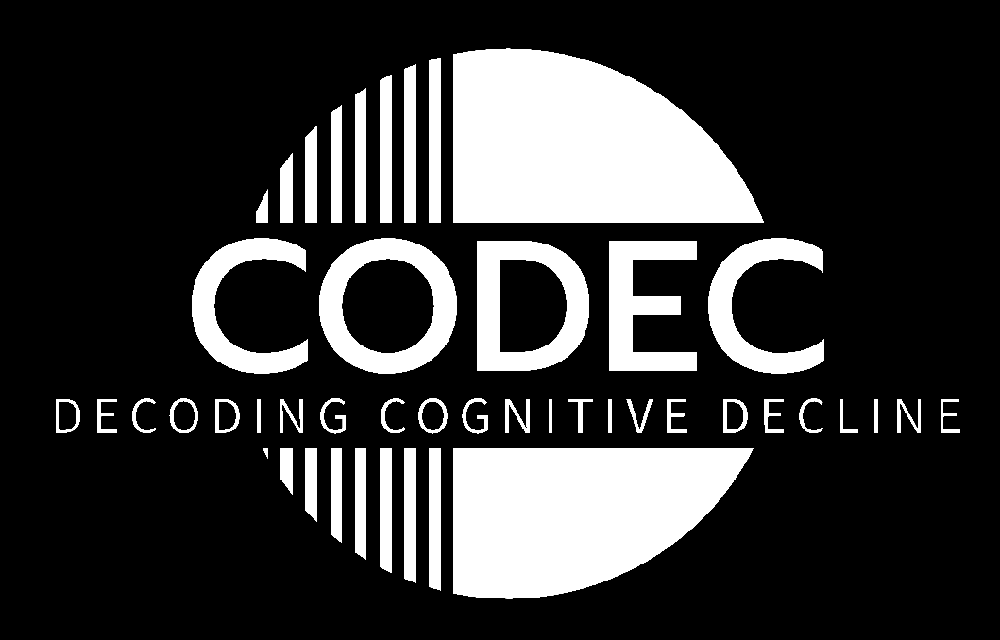

Title: Welcome!
Date: 2022-11-01 09:20
Author: MM
tags: welcome
slug: welcome

# Welcome to CODEC - Decoding Cognitive Decline
################################

Thank you for visiting our website! The CODEC team is based at University College London's Centre for Medical Image Computing and is led by Neil Oxtoby.
Our research focuses on developing and applying computer science approaches to determining the progression of degenerative neurological diseases like Alzheimer’s and Parkinson's Disease.

Through our work and several collaborations (including the DEMON Network) we aim to develop interpretable generative models that can provide healthcare professionals and patients with useful and actionable information.

 

<table border="0">
 <tr>
    <td align="center"><h4></h4></td>
    <td align="center"><h4></h4></td>
    <td align="center"><h4></h4></td>
    <td align="center"><h4></h4></td>
 </tr>
  <tr>
    <td align="center"><h4> </h4></td>
    <td align="center"><h4></h4></td>
    <td align="center"><h4></h4></td>
    <td align="center"><h4></h4></td>
</table>
